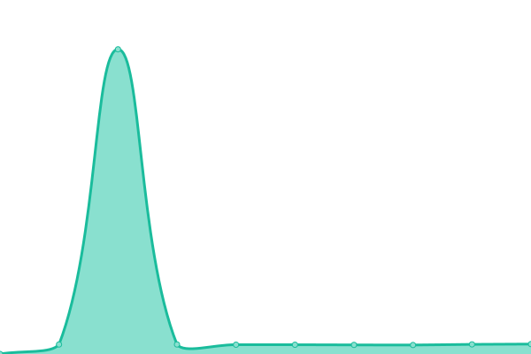
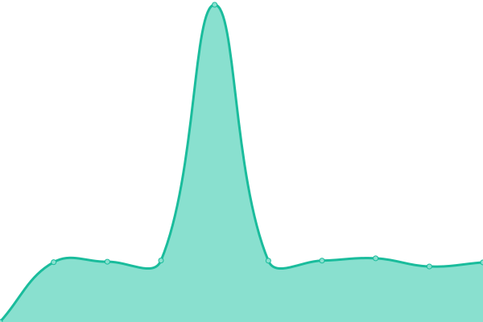
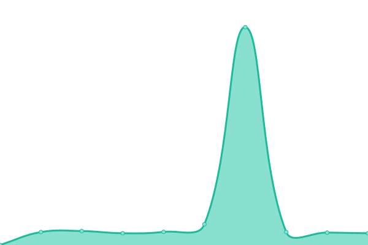

# [📈 Live Status](https://GBIFes.github.io/status): <!--live status--> **🟩 All systems operational**

This repository contains the open-source uptime monitor and status page for [GBIF Spain](https://www.gbif.es), powered by [Upptime](https://github.com/upptime/upptime).

With [Upptime](https://upptime.js.org), you can get your own unlimited and free uptime monitor and status page, powered entirely by a GitHub repository. We use [Issues](https://github.com/GBIFes/status/issues) as incident reports, [Actions](https://github.com/GBIFes/status/actions) as uptime monitors, and [Pages](https://GBIFes.github.io/status) for the status page.

<!--start: status pages-->
<!-- This summary is generated by Upptime (https://github.com/upptime/upptime) -->
<!-- Do not edit this manually, your changes will be overwritten -->
<!-- prettier-ignore -->
| URL | Status | History | Response Time | Uptime |
| --- | ------ | ------- | ------------- | ------ |
|  [GBIF Spain](https://gbif.es) | 🟩 Up | [gbif-spain.yml](https://github.com/GBIFes/status/commits/HEAD/history/gbif-spain.yml) | 

 1560ms
     
 | 

<a href="https://GBIFes.github.io/status/history/gbif-spain">100.00%</a>
    

|  [Portal de Datos de GBIF.es](https://datos.gbif.es) | 🟩 Up | [portal-de-datos-de-gbif-es.yml](https://github.com/GBIFes/status/commits/HEAD/history/portal-de-datos-de-gbif-es.yml) | 

 813ms
     
 | 

<a href="https://GBIFes.github.io/status/history/portal-de-datos-de-gbif-es">100.00%</a>
    

|  [Colecciones de historia natural de España](https://colecciones.gbif.es) | 🟩 Up | [colecciones-de-historia-natural-de-espana.yml](https://github.com/GBIFes/status/commits/HEAD/history/colecciones-de-historia-natural-de-espana.yml) | 

 1340ms
     
 | 

<a href="https://GBIFes.github.io/status/history/colecciones-de-historia-natural-de-espana">100.00%</a>
    

|  [Búsqueda de registros Portal de Datos de GBIF.ES](https://registros.gbif.es) | 🟩 Up | [busqueda-de-registros-portal-de-datos-de-gbif-es.yml](https://github.com/GBIFes/status/commits/HEAD/history/busqueda-de-registros-portal-de-datos-de-gbif-es.yml) | 

 1570ms
     
 | 

<a href="https://GBIFes.github.io/status/history/busqueda-de-registros-portal-de-datos-de-gbif-es">100.00%</a>
    

|  [Registros Webservices](https://registros-ws.gbif.es) | 🟩 Up | [registros-webservices.yml](https://github.com/GBIFes/status/commits/HEAD/history/registros-webservices.yml) | 

 766ms
     
 | 

<a href="https://GBIFes.github.io/status/history/registros-webservices">100.00%</a>
    

|  [Especies](https://especies.gbif.es) | 🟩 Up | [especies.yml](https://github.com/GBIFes/status/commits/HEAD/history/especies.yml) | 

 891ms
     
 | 

<a href="https://GBIFes.github.io/status/history/especies">100.00%</a>
    

|  [Especies Webservices](https://especies-ws.gbif.es) | 🟩 Up | [especies-webservices.yml](https://github.com/GBIFes/status/commits/HEAD/history/especies-webservices.yml) | 

 870ms
     
 | 

<a href="https://GBIFes.github.io/status/history/especies-webservices">100.00%</a>
    

|  [Regiones](https://regiones.gbif.es) | 🟩 Up | [regiones.yml](https://github.com/GBIFes/status/commits/HEAD/history/regiones.yml) | 

 888ms
     
 | 

<a href="https://GBIFes.github.io/status/history/regiones">100.00%</a>
    

|  [Listas de Especies](https://listas.gbif.es) | 🟩 Up | [listas-de-especies.yml](https://github.com/GBIFes/status/commits/HEAD/history/listas-de-especies.yml) | 

 1102ms
     
 | 

<a href="https://GBIFes.github.io/status/history/listas-de-especies">100.00%</a>
    

|  [Portal Espacial](https://espacial.gbif.es) | 🟩 Up | [portal-espacial.yml](https://github.com/GBIFes/status/commits/HEAD/history/portal-espacial.yml) | 

 1552ms
     
 | 

<a href="https://GBIFes.github.io/status/history/portal-espacial">100.00%</a>
    

|  [Servicio de Imágenes](https://imagenes.gbif.es) | 🟩 Up | [servicio-de-imagenes.yml](https://github.com/GBIFes/status/commits/HEAD/history/servicio-de-imagenes.yml) | 

 1265ms
     
 | 

<a href="https://GBIFes.github.io/status/history/servicio-de-imagenes">100.00%</a>
    

|  [CAS](https://auth.gbif.es/cas/) | 🟩 Up | [cas.yml](https://github.com/GBIFes/status/commits/HEAD/history/cas.yml) | 

 459ms
     
 | 

<a href="https://GBIFes.github.io/status/history/cas">100.00%</a>
    

|  [Userdetails](https://auth.gbif.es/userdetails/) | 🟩 Up | [userdetails.yml](https://github.com/GBIFes/status/commits/HEAD/history/userdetails.yml) | 

 321ms
     
 | 

<a href="https://GBIFes.github.io/status/history/userdetails">100.00%</a>
    

|  [Apikey](https://auth.gbif.es/apikey/) | 🟩 Up | [apikey.yml](https://github.com/GBIFes/status/commits/HEAD/history/apikey.yml) | 

 306ms
     
 | 

<a href="https://GBIFes.github.io/status/history/apikey">100.00%</a>
    

|  [CAS Management](https://auth.gbif.es/cas-management/) | 🟩 Up | [cas-management.yml](https://github.com/GBIFes/status/commits/HEAD/history/cas-management.yml) | 

 623ms
     
 | 

<a href="https://GBIFes.github.io/status/history/cas-management">100.00%</a>
    

|  [Servicio de DOI](https://doi.gbif.es) | 🟩 Up | [servicio-de-doi.yml](https://github.com/GBIFes/status/commits/HEAD/history/servicio-de-doi.yml) | 

 917ms
     
 | 

<a href="https://GBIFes.github.io/status/history/servicio-de-doi">100.00%</a>
    

|  [Dashboard de GBIF.es](https://dashboard.gbif.es) | 🟩 Up | [dashboard-de-gbif-es.yml](https://github.com/GBIFes/status/commits/HEAD/history/dashboard-de-gbif-es.yml) | 

 1957ms
     
 | 

<a href="https://GBIFes.github.io/status/history/dashboard-de-gbif-es">100.00%</a>
    

|  [Alertas de GBIF.es](https://alertas.gbif.es) | 🟩 Up | [alertas-de-gbif-es.yml](https://github.com/GBIFes/status/commits/HEAD/history/alertas-de-gbif-es.yml) | 

 1252ms
     
 | 

<a href="https://GBIFes.github.io/status/history/alertas-de-gbif-es">100.00%</a>
    

|  [Logger](https://logger.gbif.es) | 🟩 Up | [logger.yml](https://github.com/GBIFes/status/commits/HEAD/history/logger.yml) | 

 862ms
     
 | 

<a href="https://GBIFes.github.io/status/history/logger">100.00%</a>
    

|  [IPT](https://ipt.gbif.es) | 🟩 Up | [ipt.yml](https://github.com/GBIFes/status/commits/HEAD/history/ipt.yml) | 

 1375ms
     
 | 

<a href="https://GBIFes.github.io/status/history/ipt">100.00%</a>
    

|  [IPT demo](https://ipt-demo.gbif.es) | 🟩 Up | [ipt-demo.yml](https://github.com/GBIFes/status/commits/HEAD/history/ipt-demo.yml) | 

 766ms
     
 | 

<a href="https://GBIFes.github.io/status/history/ipt-demo">100.00%</a>
    

|  [LA demo](https://demo.gbif.es) | 🟩 Up | [la-demo.yml](https://github.com/GBIFes/status/commits/HEAD/history/la-demo.yml) | 

 681ms
     
 | 

<a href="https://GBIFes.github.io/status/history/la-demo">100.00%</a>
    

|  [eLearning GBIF.es](https://elearning.gbif.es) | 🟩 Up | [e-learning-gbif-es.yml](https://github.com/GBIFes/status/commits/HEAD/history/e-learning-gbif-es.yml) | 

 1098ms
     
 | 

<a href="https://GBIFes.github.io/status/history/e-learning-gbif-es">100.00%</a>
    

|  [Repositorio APT](apt.gbif.es) | 🟩 Up | [repositorio-apt.yml](https://github.com/GBIFes/status/commits/HEAD/history/repositorio-apt.yml) | 

 894ms
     
 | 

<a href="https://GBIFes.github.io/status/history/repositorio-apt">100.00%</a>
    

|  [Infraestructura Iberoamericana de Información sobre Biodiversidad](https://recibio.net) | 🟩 Up | [infraestructura-iberoamericana-de-informacion-sobre-biodiversidad.yml](https://github.com/GBIFes/status/commits/HEAD/history/infraestructura-iberoamericana-de-informacion-sobre-biodiversidad.yml) | 

 1571ms
     
 | 

<a href="https://GBIFes.github.io/status/history/infraestructura-iberoamericana-de-informacion-sobre-biodiversidad">100.00%</a>
    

<!--end: status pages-->

[**Visit our status website →**](https://GBIFes.github.io/status)

## 📄 License

- Powered by: [Upptime](https://github.com/upptime/upptime)
- Code: [MIT](./LICENSE) © [GBIF Spain](https://www.gbif.es)
- Data in the `./history` directory: [Open Database License](https://opendatacommons.org/licenses/odbl/1-0/)
