# [📈 Live Status](https://GBIFes.github.io/status): <!--live status--> **🟩 All systems operational**

This repository contains the open-source uptime monitor and status page for [GBIF Spain](https://www.gbif.es), powered by [Upptime](https://github.com/upptime/upptime).

With [Upptime](https://upptime.js.org), you can get your own unlimited and free uptime monitor and status page, powered entirely by a GitHub repository. We use [Issues](https://github.com/GBIFes/status/issues) as incident reports, [Actions](https://github.com/GBIFes/status/actions) as uptime monitors, and [Pages](https://GBIFes.github.io/status) for the status page.

<!--start: status pages-->
<!-- This summary is generated by Upptime (https://github.com/upptime/upptime) -->
<!-- Do not edit this manually, your changes will be overwritten -->
<!-- prettier-ignore -->
| URL | Status | History | Response Time | Uptime |
| --- | ------ | ------- | ------------- | ------ |
|  [Web de GBIF.ES](https://gbif.es) | 🟩 Up | [web-de-gbif-es.yml](https://github.com/GBIFes/status/commits/HEAD/history/web-de-gbif-es.yml) | 

 1135ms
     
 | 

<a href="https://GBIFes.github.io/status/history/web-de-gbif-es">100.00%</a>
    

|  [Portal de Datos de GBIF.ES](https://datos.gbif.es) | 🟩 Up | [portal-de-datos-de-gbif-es.yml](https://github.com/GBIFes/status/commits/HEAD/history/portal-de-datos-de-gbif-es.yml) | 

 622ms
     
 | 

<a href="https://GBIFes.github.io/status/history/portal-de-datos-de-gbif-es">100.00%</a>
    

|  [Alerts service](https://alertas.gbif.es) | 🟩 Up | [alerts-service.yml](https://github.com/GBIFes/status/commits/HEAD/history/alerts-service.yml) | 

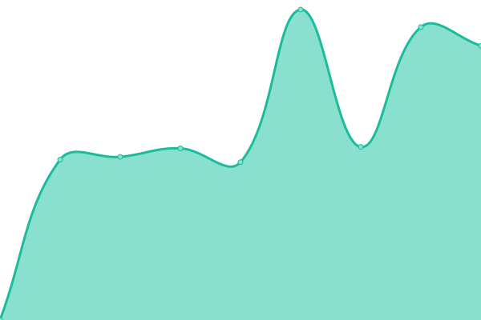 5783ms
     
 | 

<a href="https://GBIFes.github.io/status/history/alerts-service">100.00%</a>
    

|  [Apikey service](https://auth.gbif.es/apikey) | 🟩 Up | [apikey-service.yml](https://github.com/GBIFes/status/commits/HEAD/history/apikey-service.yml) | 

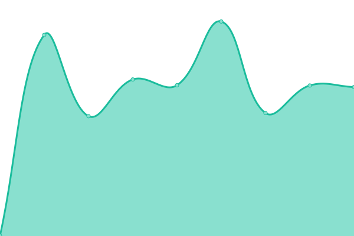 1365ms
     
 | 

<a href="https://GBIFes.github.io/status/history/apikey-service">100.00%</a>
    

|  [CAS service](https://auth.gbif.es/cas) | 🟩 Up | [cas-service.yml](https://github.com/GBIFes/status/commits/HEAD/history/cas-service.yml) | 

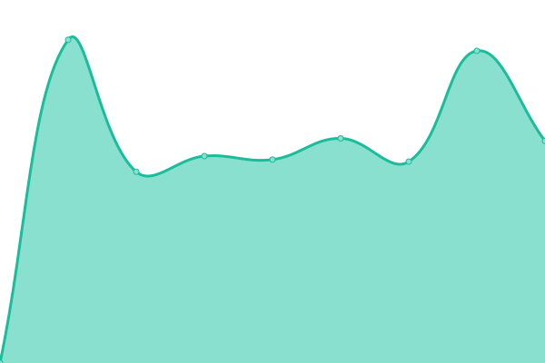 1687ms
     
 | 

<a href="https://GBIFes.github.io/status/history/cas-service">100.00%</a>
    

|  [CAS management service](https://auth.gbif.es/cas-management/) | 🟩 Up | [cas-management-service.yml](https://github.com/GBIFes/status/commits/HEAD/history/cas-management-service.yml) | 

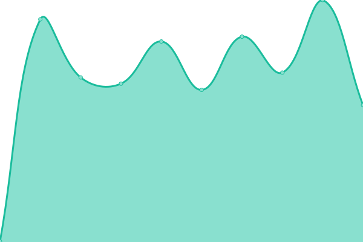 997ms
     
 | 

<a href="https://GBIFes.github.io/status/history/cas-management-service">100.00%</a>
    

|  [Userdetails service](https://auth.gbif.es/userdetails) | 🟩 Up | [userdetails-service.yml](https://github.com/GBIFes/status/commits/HEAD/history/userdetails-service.yml) | 

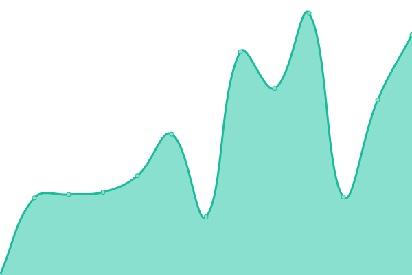 1275ms
     
 | 

<a href="https://GBIFes.github.io/status/history/userdetails-service">100.00%</a>
    

|  [Species service (bie)](https://especies.gbif.es) | 🟩 Up | [species-service-bie.yml](https://github.com/GBIFes/status/commits/HEAD/history/species-service-bie.yml) | 

 601ms
     
 | 

<a href="https://GBIFes.github.io/status/history/species-service-bie">100.00%</a>
    

|  [Species web services (bie-index)](https://especies-ws.gbif.es) | 🟩 Up | [species-web-services-bie-index.yml](https://github.com/GBIFes/status/commits/HEAD/history/species-web-services-bie-index.yml) | 

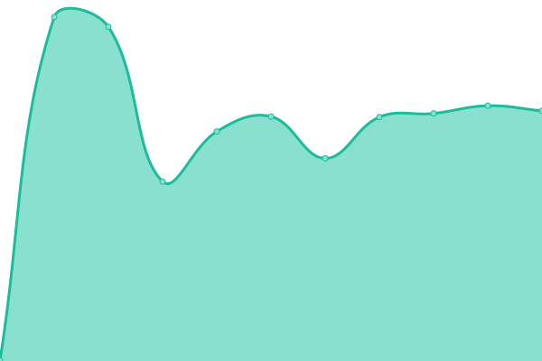 497ms
     
 | 

<a href="https://GBIFes.github.io/status/history/species-web-services-bie-index">100.00%</a>
    

|  [Species test search](https://especies.gbif.es/search?q=acacia) | 🟩 Up | [species-test-search.yml](https://github.com/GBIFes/status/commits/HEAD/history/species-test-search.yml) | 

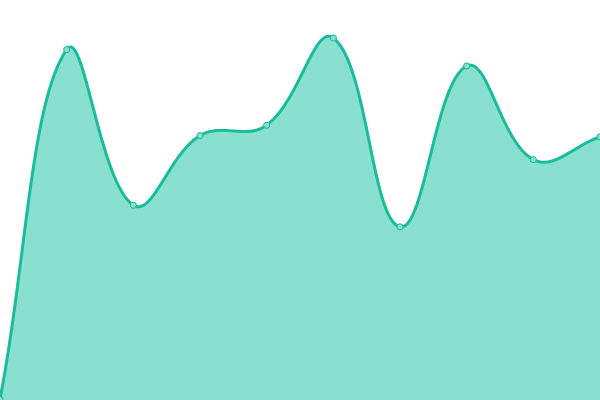 704ms
     
 | 

<a href="https://GBIFes.github.io/status/history/species-test-search">100.00%</a>
    

|  [Species page](https://especies.gbif.es/species/2978223) | 🟩 Up | [species-page.yml](https://github.com/GBIFes/status/commits/HEAD/history/species-page.yml) | 

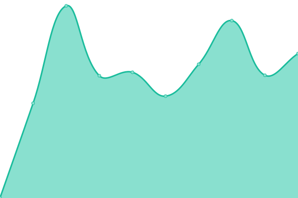 1640ms
     
 | 

<a href="https://GBIFes.github.io/status/history/species-page">100.00%</a>
    

|  [Records service (biocache)](https://registros.gbif.es) | 🟩 Up | [records-service-biocache.yml](https://github.com/GBIFes/status/commits/HEAD/history/records-service-biocache.yml) | 

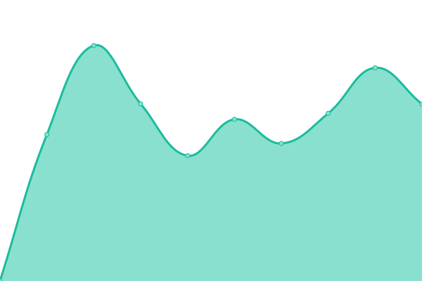 2016ms
     
 | 

<a href="https://GBIFes.github.io/status/history/records-service-biocache">100.00%</a>
    

|  [Records service - Explore your area](https://registros.gbif.es/explore/your-area/) | 🟩 Up | [records-service-explore-your-area.yml](https://github.com/GBIFes/status/commits/HEAD/history/records-service-explore-your-area.yml) | 

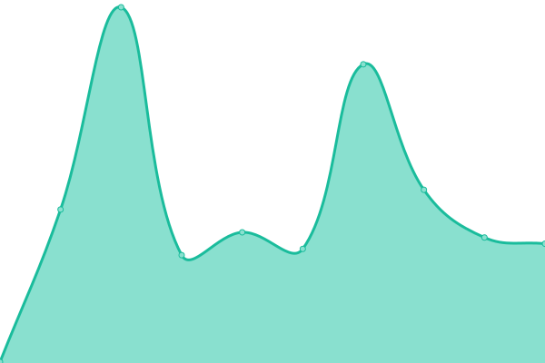 672ms
     
 | 

<a href="https://GBIFes.github.io/status/history/records-service-explore-your-area">100.00%</a>
    

|  [Records test search](https://registros.gbif.es/occurrences/search?q=taxa%3A%22acacia%22#tab_recordsView) | 🟩 Up | [records-test-search.yml](https://github.com/GBIFes/status/commits/HEAD/history/records-test-search.yml) | 

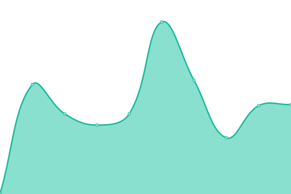 1260ms
     
 | 

<a href="https://GBIFes.github.io/status/history/records-test-search">100.00%</a>
    

|  [Records web services (biocache-service)](https://registros-ws.gbif.es) | 🟩 Up | [records-web-services-biocache-service.yml](https://github.com/GBIFes/status/commits/HEAD/history/records-web-services-biocache-service.yml) | 

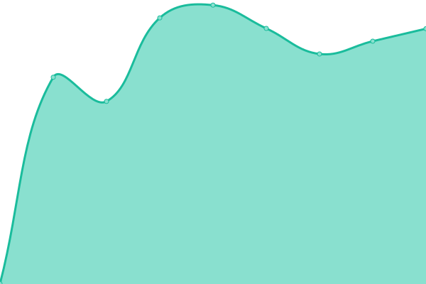 1276ms
     
 | 

<a href="https://GBIFes.github.io/status/history/records-web-services-biocache-service">100.00%</a>
    

|  [Collections service](https://colecciones.gbif.es) | 🟩 Up | [collections-service.yml](https://github.com/GBIFes/status/commits/HEAD/history/collections-service.yml) | 

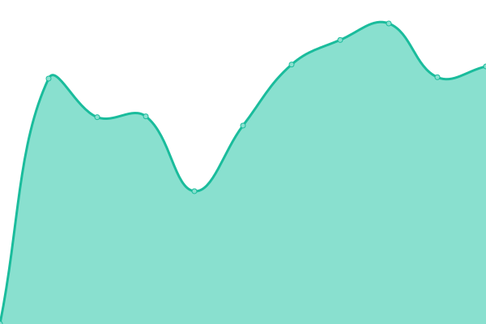 849ms
     
 | 

<a href="https://GBIFes.github.io/status/history/collections-service">100.00%</a>
    

|  [Collections web services](https://colecciones.gbif.es/ws) | 🟩 Up | [collections-web-services.yml](https://github.com/GBIFes/status/commits/HEAD/history/collections-web-services.yml) | 

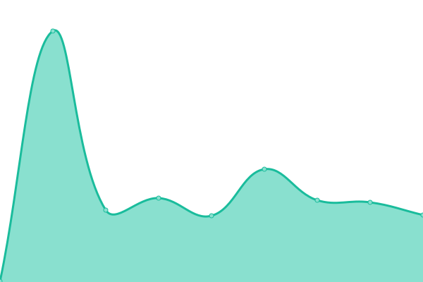 684ms
     
 | 

<a href="https://GBIFes.github.io/status/history/collections-web-services">100.00%</a>
    

|  [Dashboard service](https://dashboard.gbif.es) | 🟩 Up | [dashboard-service.yml](https://github.com/GBIFes/status/commits/HEAD/history/dashboard-service.yml) | 

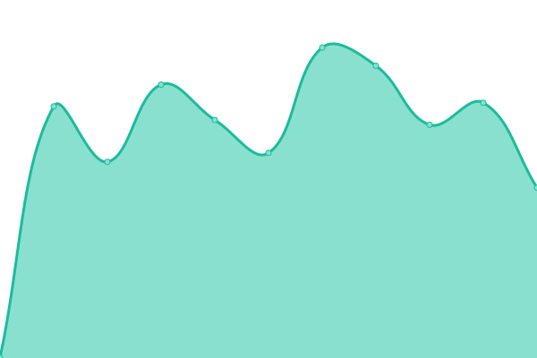 826ms
     
 | 

<a href="https://GBIFes.github.io/status/history/dashboard-service">100.00%</a>
    

|  [Data quality service](https://data-quality.gbif.es) | 🟩 Up | [data-quality-service.yml](https://github.com/GBIFes/status/commits/HEAD/history/data-quality-service.yml) | 

 1408ms
     
 | 

<a href="https://GBIFes.github.io/status/history/data-quality-service">100.00%</a>
    

|  [Data quality profiles](https://data-quality.gbif.es/api/v1/data-profiles?enabled=true) | 🟩 Up | [data-quality-profiles.yml](https://github.com/GBIFes/status/commits/HEAD/history/data-quality-profiles.yml) | 

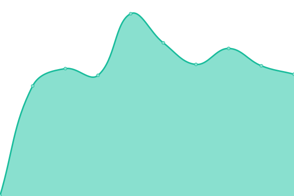 537ms
     
 | 

<a href="https://GBIFes.github.io/status/history/data-quality-profiles">100.00%</a>
    

|  [DOI web services](https://doi.gbif.es/api/) | 🟩 Up | [doi-web-services.yml](https://github.com/GBIFes/status/commits/HEAD/history/doi-web-services.yml) | 

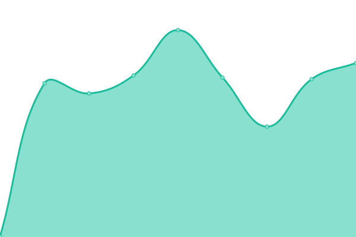 451ms
     
 | 

<a href="https://GBIFes.github.io/status/history/doi-web-services">100.00%</a>
    

|  [DOI service](https://doi.gbif.es) | 🟩 Up | [doi-service.yml](https://github.com/GBIFes/status/commits/HEAD/history/doi-service.yml) | 

 533ms
     
 | 

<a href="https://GBIFes.github.io/status/history/doi-service">100.00%</a>
    

|  [Branding website](https://datos.gbif.es/brand-2020-brunch) | 🟩 Up | [branding-website.yml](https://github.com/GBIFes/status/commits/HEAD/history/branding-website.yml) | 

 927ms
     
 | 

<a href="https://GBIFes.github.io/status/history/branding-website">100.00%</a>
    

|  [Image service](https://imagenes.gbif.es) | 🟩 Up | [image-service.yml](https://github.com/GBIFes/status/commits/HEAD/history/image-service.yml) | 

 813ms
     
 | 

<a href="https://GBIFes.github.io/status/history/image-service">100.00%</a>
    

|  [Logger service](https://logger.gbif.es) | 🟩 Up | [logger-service.yml](https://github.com/GBIFes/status/commits/HEAD/history/logger-service.yml) | 

 586ms
     
 | 

<a href="https://GBIFes.github.io/status/history/logger-service">100.00%</a>
    

|  [Logger reasons url](https://logger.gbif.es/service/logger/reasons) | 🟩 Up | [logger-reasons-url.yml](https://github.com/GBIFes/status/commits/HEAD/history/logger-reasons-url.yml) | 

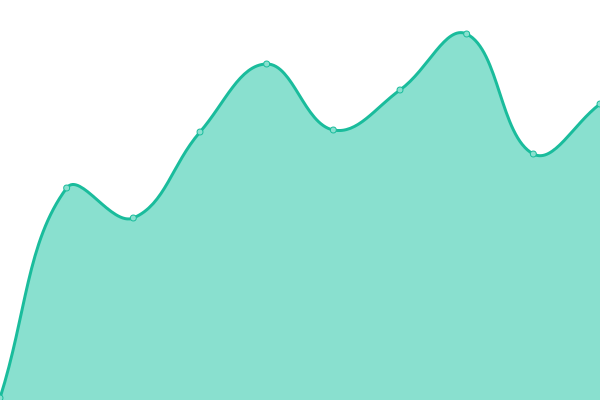 392ms
     
 | 

<a href="https://GBIFes.github.io/status/history/logger-reasons-url">100.00%</a>
    

|  [Namematching service](https://name-matching.gbif.es) | 🟩 Up | [namematching-service.yml](https://github.com/GBIFes/status/commits/HEAD/history/namematching-service.yml) | 

 830ms
     
 | 

<a href="https://GBIFes.github.io/status/history/namematching-service">100.00%</a>
    

|  [Namematching service (correct name index)](https://name-matching.gbif.es/api/search?q=Cenchrus%20setaceus) | 🟩 Up | [namematching-service-correct-name-index.yml](https://github.com/GBIFes/status/commits/HEAD/history/namematching-service-correct-name-index.yml) | 

 395ms
     
 | 

<a href="https://GBIFes.github.io/status/history/namematching-service-correct-name-index">100.00%</a>
    

|  [Namematching service (correct basionyms)](https://name-matching.gbif.es/api/search?q=Cenchrus%20setaceus) | 🟩 Up | [namematching-service-correct-basionyms.yml](https://github.com/GBIFes/status/commits/HEAD/history/namematching-service-correct-basionyms.yml) | 

 403ms
     
 | 

<a href="https://GBIFes.github.io/status/history/namematching-service-correct-basionyms">100.00%</a>
    

|  [Regions service](https://regiones.gbif.es) | 🟩 Up | [regions-service.yml](https://github.com/GBIFes/status/commits/HEAD/history/regions-service.yml) | 

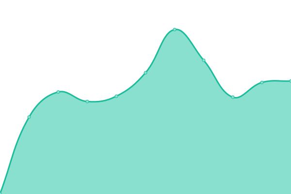 564ms
     
 | 

<a href="https://GBIFes.github.io/status/history/regions-service">100.00%</a>
    

|  [Sensitive service](https://sds.gbif.es) | 🟩 Up | [sensitive-service.yml](https://github.com/GBIFes/status/commits/HEAD/history/sensitive-service.yml) | 

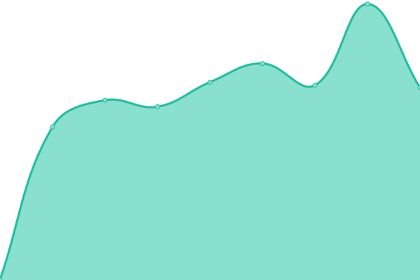 574ms
     
 | 

<a href="https://GBIFes.github.io/status/history/sensitive-service">100.00%</a>
    

|  [Spatial hub service](https://espacial.gbif.es) | 🟩 Up | [spatial-hub-service.yml](https://github.com/GBIFes/status/commits/HEAD/history/spatial-hub-service.yml) | 

 5401ms
     
 | 

<a href="https://GBIFes.github.io/status/history/spatial-hub-service">100.00%</a>
    

|  [Spatial web service](https://espacial.gbif.es/ws) | 🟩 Up | [spatial-web-service.yml](https://github.com/GBIFes/status/commits/HEAD/history/spatial-web-service.yml) | 

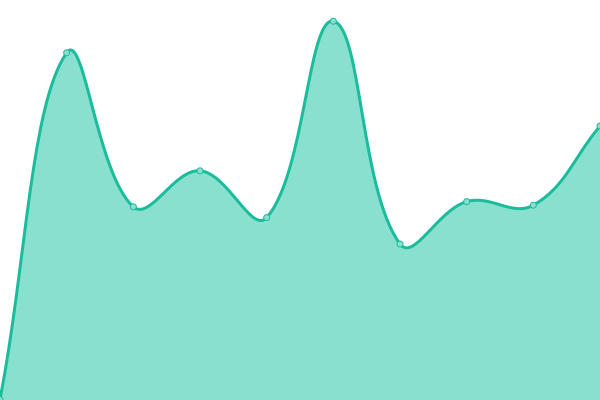 925ms
     
 | 

<a href="https://GBIFes.github.io/status/history/spatial-web-service">100.00%</a>
    

|  [Spatial fields](https://espacial.gbif.es/ws/fields) | 🟩 Up | [spatial-fields.yml](https://github.com/GBIFes/status/commits/HEAD/history/spatial-fields.yml) | 

 394ms
     
 | 

<a href="https://GBIFes.github.io/status/history/spatial-fields">100.00%</a>
    

|  [Geoserver service](https://espacial.gbif.es/geoserver) | 🟩 Up | [geoserver-service.yml](https://github.com/GBIFes/status/commits/HEAD/history/geoserver-service.yml) | 

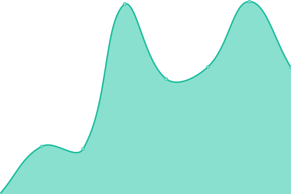 777ms
     
 | 

<a href="https://GBIFes.github.io/status/history/geoserver-service">100.00%</a>
    

|  [Species Lists service](https://listas.gbif.es) | 🟩 Up | [species-lists-service.yml](https://github.com/GBIFes/status/commits/HEAD/history/species-lists-service.yml) | 

 1098ms
     
 | 

<a href="https://GBIFes.github.io/status/history/species-lists-service">100.00%</a>
    

|  [Sensitive data service](https://datos-sensibles.gbif.es) | 🟩 Up | [sensitive-data-service.yml](https://github.com/GBIFes/status/commits/HEAD/history/sensitive-data-service.yml) | 

 821ms
     
 | 

<a href="https://GBIFes.github.io/status/history/sensitive-data-service">100.00%</a>
    

|  [Sensitive data service (correct name index)](https://datos-sensibles.gbif.es/api/isSensitive?scientificName=lynx%20pardinus) | 🟩 Up | [sensitive-data-service-correct-name-index.yml](https://github.com/GBIFes/status/commits/HEAD/history/sensitive-data-service-correct-name-index.yml) | 

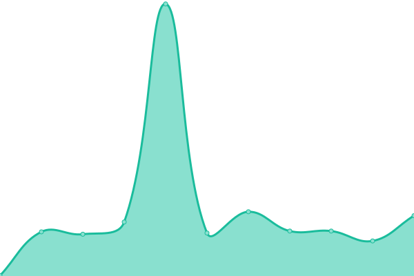 401ms
     
 | 

<a href="https://GBIFes.github.io/status/history/sensitive-data-service-correct-name-index">100.00%</a>
    

|  [IPT](https://ipt.gbif.es) | 🟩 Up | [ipt.yml](https://github.com/GBIFes/status/commits/HEAD/history/ipt.yml) | 

 595ms
     
 | 

<a href="https://GBIFes.github.io/status/history/ipt">100.00%</a>
    

|  [IPT demo](https://ipt-demo.gbif.es) | 🟩 Up | [ipt-demo.yml](https://github.com/GBIFes/status/commits/HEAD/history/ipt-demo.yml) | 

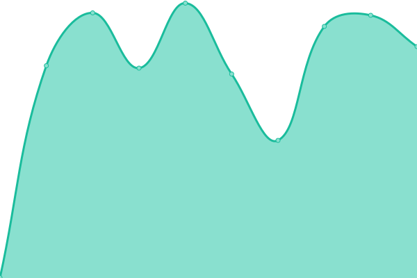 614ms
     
 | 

<a href="https://GBIFes.github.io/status/history/ipt-demo">100.00%</a>
    

|  [IPT demo plic](https://ipt-demo-plic.gbif.es) | 🟩 Up | [ipt-demo-plic.yml](https://github.com/GBIFes/status/commits/HEAD/history/ipt-demo-plic.yml) | 

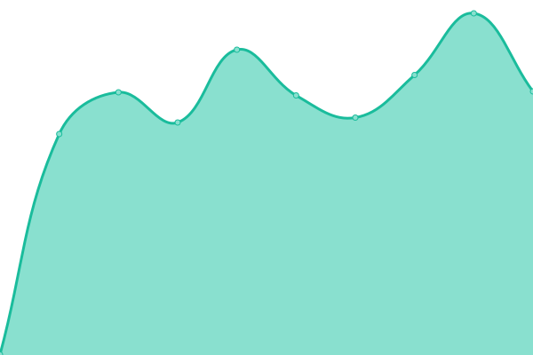 563ms
     
 | 

<a href="https://GBIFes.github.io/status/history/ipt-demo-plic">100.00%</a>
    

|  [LA demo](https://demo.gbif.es) | 🟩 Up | [la-demo.yml](https://github.com/GBIFes/status/commits/HEAD/history/la-demo.yml) | 

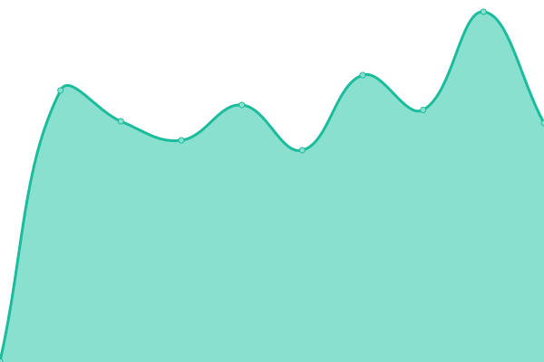 567ms
     
 | 

<a href="https://GBIFes.github.io/status/history/la-demo">100.00%</a>
    

|  [eLearning GBIF.es](https://elearning.gbif.es) | 🟩 Up | [e-learning-gbif-es.yml](https://github.com/GBIFes/status/commits/HEAD/history/e-learning-gbif-es.yml) | 

 866ms
     
 | 

<a href="https://GBIFes.github.io/status/history/e-learning-gbif-es">100.00%</a>
    

|  [Repositorio APT](https://apt.gbif.es) | 🟩 Up | [repositorio-apt.yml](https://github.com/GBIFes/status/commits/HEAD/history/repositorio-apt.yml) | 

 460ms
     
 | 

<a href="https://GBIFes.github.io/status/history/repositorio-apt">100.00%</a>
    

|  [Infraestructura Iberoamericana de Información sobre Biodiversidad](https://recibio.net) | 🟩 Up | [infraestructura-iberoamericana-de-informacion-sobre-biodiversidad.yml](https://github.com/GBIFes/status/commits/HEAD/history/infraestructura-iberoamericana-de-informacion-sobre-biodiversidad.yml) | 

 1340ms
     
 | 

<a href="https://GBIFes.github.io/status/history/infraestructura-iberoamericana-de-informacion-sobre-biodiversidad">100.00%</a>
    

|  [Difusion](https://difusion.gbif.es) | 🟩 Up | [difusion.yml](https://github.com/GBIFes/status/commits/HEAD/history/difusion.yml) | 

 438ms
     
 | 

<a href="https://GBIFes.github.io/status/history/difusion">100.00%</a>
    

|  [CSIC Hub](https://csic.gbif.es) | 🟩 Up | [csic-hub.yml](https://github.com/GBIFes/status/commits/HEAD/history/csic-hub.yml) | 

 546ms
     
 | 

<a href="https://GBIFes.github.io/status/history/csic-hub">100.00%</a>
    

|  [Colecciones Botánicas Hub](https://colecciones-botanicas.gbif.es/) | 🟩 Up | [colecciones-botanicas-hub.yml](https://github.com/GBIFes/status/commits/HEAD/history/colecciones-botanicas-hub.yml) | 

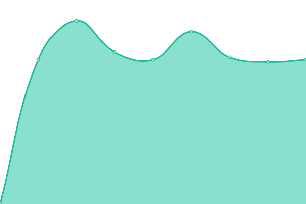 566ms
     
 | 

<a href="https://GBIFes.github.io/status/history/colecciones-botanicas-hub">100.00%</a>
    

|  [Colecciones Marinas Hub](https://colecciones-marinas.gbif.es/) | 🟩 Up | [colecciones-marinas-hub.yml](https://github.com/GBIFes/status/commits/HEAD/history/colecciones-marinas-hub.yml) | 

 531ms
     
 | 

<a href="https://GBIFes.github.io/status/history/colecciones-marinas-hub">100.00%</a>
    

|  [mail service](https://mail.gbif.es) | 🟩 Up | [mail-service.yml](https://github.com/GBIFes/status/commits/HEAD/history/mail-service.yml) | 

 749ms
     
 | 

<a href="https://GBIFes.github.io/status/history/mail-service">100.00%</a>
    

<!--end: status pages-->

[**Visit our status website →**](https://GBIFes.github.io/status)

## 📄 License

- Powered by: [Upptime](https://github.com/upptime/upptime)
- Code: [MIT](./LICENSE) © [GBIF Spain](https://www.gbif.es)
- Data in the `./history` directory: [Open Database License](https://opendatacommons.org/licenses/odbl/1-0/)
